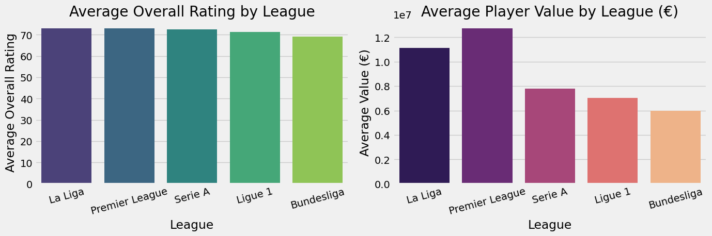
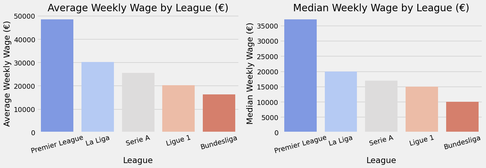
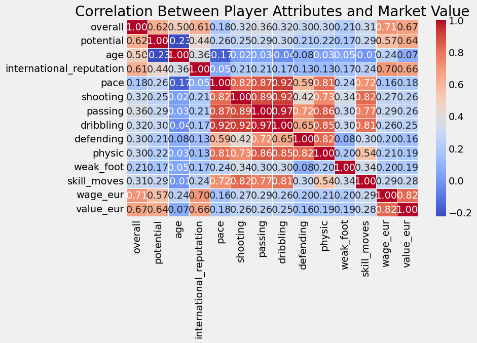
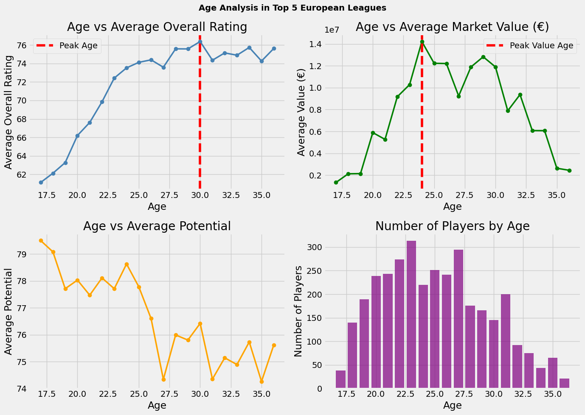
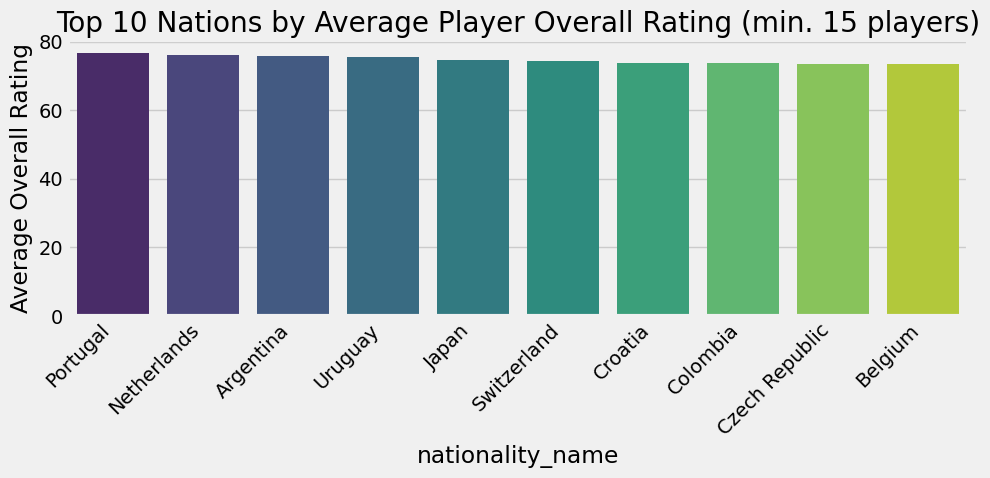
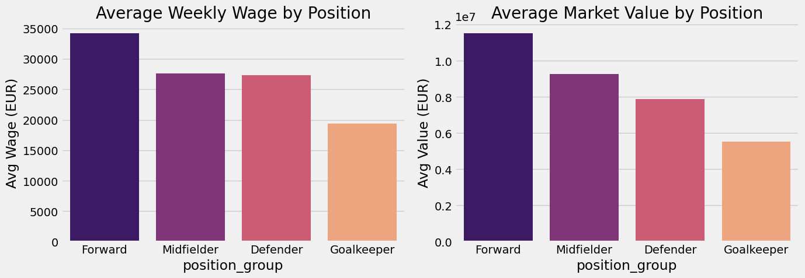
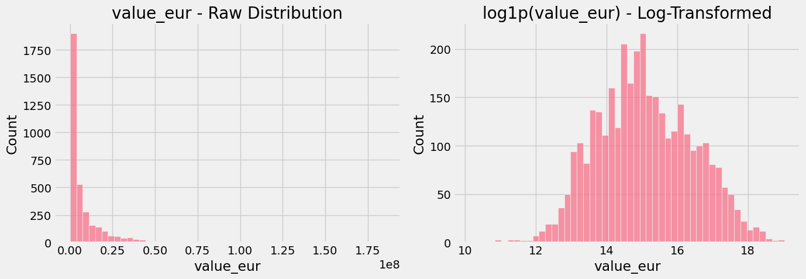
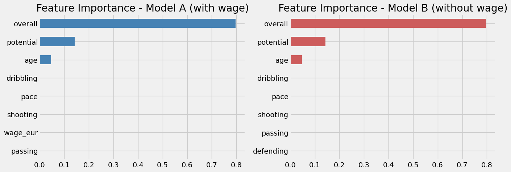
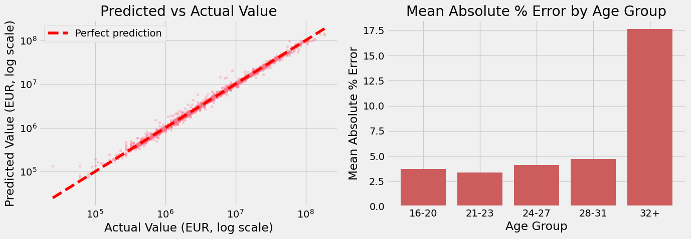

# ⚽ Football Intelligence Dashboard

**What actually drives a footballer's market value?** An end-to-end data science project that scrapes, cleans, explores, and models FIFA 24 player data from Europe's top 5 leagues to answer that question — and along the way, uncovers a counter-intuitive insight about what *looks* predictive versus what actually *is*.

### 🚀 [Try the live demo →](https://football-intelligence.streamlit.app)

Search any real player from the top 5 leagues and see the model's prediction next to their actual value, or build a custom player with the sliders — either way, a chart breaks down exactly which attributes drove that specific prediction (powered by SHAP).

---

## 📌 Project Overview

Using player data from the Premier League, La Liga, Serie A, Bundesliga, and Ligue 1, this project:

1. Cleans and prepares a raw dataset of 3,467 players
2. Explores 7 business questions about league quality, wages, value drivers, and undervalued talent
3. Builds and compares regression models to predict player market value
4. Tests whether wage data actually helps predict value, or is just a proxy for skill the model already has
5. Validates the final model with cross-validation and error analysis to find exactly where it struggles

**Headline result:** A Random Forest model explains **98% of the variance** in player value using only on-pitch attributes (validated with 5-fold cross-validation) — and doesn't need wage data to do it. Error analysis further shows exactly where it struggles: aging veterans and goalkeepers.

---

## 📂 Repo Structure

```
├── data/
│   ├── raw/
│   │   ├── Dataset/male_players.csv    # original raw scrape source (not tracked in git — see .gitignore)
│   │   └── fifa24_players.csv          # FIFA 24 filtered, pre-league-filter
│   └── cleaned/
│       └── fifa24_top5_leagues.csv     # 3,467 players, 40 attributes, top 5 leagues
├── notebooks/
│   ├── 01_scraping.ipynb               # Raw data → filtered, cleaned dataset
│   ├── 02_eda.ipynb                    # 7 business questions, explored & answered
│   └── 03_modeling.ipynb               # Feature engineering, model comparison, feature importance
├── streamlit_app/                      # Live interactive demo (deployed to Streamlit Cloud)
│   ├── app.py
│   ├── value_model.pkl
│   ├── feature_columns.json
│   └── requirements.txt
├── assets/                             # Charts referenced in this README
└── README.md
```

---

## 🗂️ Dataset

Sourced from a public FIFA 24 player ratings dataset, filtered down to:
- **3,467 players** across the **top 5 European leagues**
- **40 attributes** per player: overall/potential rating, market value, wage, position, physical and technical attributes, nationality, club, and more

**Data cleaning:** 402 players (all goalkeepers) were missing outfield attributes (`pace`, `shooting`, `passing`, `dribbling`, `defending`, `physic`) — expected, since FIFA doesn't rate goalkeepers on those skills. These and 233 missing `release_clause_eur` values were filled with 0 rather than dropped, preserving the full player set.

---

## 🔍 Exploratory Data Analysis — Key Findings

### Q1: Which league has the best players?


**La Liga edges out the Premier League** in average player quality (73.05 vs 72.91), but the Premier League pays significantly more (€12.7M avg value vs €11.1M). The Bundesliga has the lowest rated and valued players but the most players overall (850) — reflecting a philosophy of developing youth over buying stars.

### Q2: Which league pays the most?


**Premier League dominates** — average weekly wage of €48,423, nearly 3x the Bundesliga's €16,304. Even the *median* EPL player (€37,000/week) out-earns most players in La Liga or Serie A, showing the gap is systemic, not just a handful of superstars.

### Q3: What makes a player valuable?


Top correlates with market value: **wage (0.82)**, **overall rating (0.67)**, **international reputation (0.66)**, **potential (0.64)**. Surprisingly, **age has almost no correlation (0.07)** — and **defending stats are the weakest technical correlate (0.15)**, suggesting the market structurally undervalues defensive skill relative to attacking output.

### Q4: Who are the most undervalued players?
Using a Value Score (overall rating ÷ value in millions) among players 29 or younger rated 78+: hidden gems included Y. Mvogo (GK, Lorient), Héctor Bellerín (DEF, Real Betis), M. Lemina (MID, Wolves), and A. Belotti (FWD, Roma). Most undervalued players cluster in **Ligue 1 and Serie A**, reinforcing that Premier League and La Liga consistently pay a premium for comparable quality.

### Q5: How does age affect performance and value?


Performance and value **peak at different ages** — average overall rating peaks at **30**, but average market value peaks earlier, at **24**. Clubs pay a premium for remaining prime years, not just current ability — explaining why age's raw correlation with value is near zero (it's a trade-off, not a linear effect).

### Q6: Which nation produces the best players?


Among nations with 15+ players in the dataset, **Portugal (76.56 avg overall)**, **Netherlands (76.02)**, and **Argentina (75.84)** lead. Austria is a notable outlier — 231 players (one of the largest groups) but the lowest average rating, suggesting it supplies squad depth rather than headline talent.

### Q7: Which position earns the most?


**Forwards earn the most** (€34,186/week avg) despite defenders having a slightly *higher* average skill rating (72.15 vs 71.94). **Goalkeepers earn the least**, roughly half of forwards. The market rewards attacking output and visibility over balanced quality — echoing the Q3 finding on defenders.

---

## 🤖 Modeling: Predicting Player Market Value

**Target:** `value_eur` — heavily right-skewed (skew = 4.27) due to a handful of superstar transfers, so the model was trained on `log1p(value_eur)` and predictions were converted back to euros for evaluation.



**Two feature sets were compared** to test a specific question raised by the EDA — does wage actually help predict value, or is it redundant?

- **Model A:** on-pitch attributes + position + `wage_eur`
- **Model B:** on-pitch attributes + position, *no* `wage_eur`

Each was trained with both a **Linear Regression** baseline and a **Random Forest**.

| Feature Set | Model | RMSE (€) | MAE (€) | R² |
|---|---|---|---|---|
| A (with wage) | Linear Regression | 9,468,126 | 2,036,706 | 0.686 |
| A (with wage) | Random Forest | 2,830,770 | 697,036 | **0.972** |
| B (no wage) | Linear Regression | 8,177,701 | 1,906,885 | 0.766 |
| B (no wage) | Random Forest | 2,676,460 | 679,177 | **0.975** |

**Random Forest massively outperforms Linear Regression** — player value doesn't move linearly with skill, and Random Forest captures those non-linear jumps naturally.

### The interesting result: wage doesn't actually help



Despite `wage_eur` having the *strongest single correlation* with value in the EDA (0.82), **Model B (without wage) performs just as well, if not marginally better** than Model A. Feature importance reveals why: `overall` (~80%) and `potential` (~14%) alone account for ~94% of the model's predictive power — `wage_eur`'s importance is a negligible ≈0.002.

**Why the disconnect between correlation and importance?** Correlation looks at one variable in isolation — wage is high *because* overall/potential are high, so it looks predictive on its own. But once a model already knows a player's rating and potential, wage adds no new information. This is **multicollinearity**: two features carrying overlapping signal, where only one gets "credit" in a multivariate model.

**Conclusion:** The final model is **Random Forest on Model B** — simpler (one fewer input, and one that isn't always public knowledge), and performs just as well. A player's market value is, in short, almost entirely explained by how good they are *right now* and how good they *could become*, with age as a moderate tiebreaker.

---

## ✅ Model Validation & Error Analysis

A single train/test split can flatter (or unfairly penalize) a model by chance. To validate the result properly, the final model was checked two further ways.

**5-fold cross-validation:** Random Forest holds up — **R² = 0.981 ± 0.008** across 5 independent folds, every fold landing between 0.97 and 0.99. Linear Regression, by contrast, swings from **0.43 to 0.93** depending on the fold — a level of instability the original single split never revealed.

**Error analysis (out-of-fold predictions across all 3,467 players):**



Overall the model is tight — **median absolute error of 3.1%**, mean of 5.3%. But the errors aren't random; they cluster in three clear patterns:

- **Elite young superstars are underpriced.** Haaland, Mbappé, Musiala, and Vinícius Jr. are all predicted €20–50M *below* their real value — a "star power" premium (brand value, proven big-game impact) that attribute ratings alone don't capture.
- **Aging veterans are overpriced, badly.** Error jumps from ~3–5% for players under 32 to **17.6%** for players 32+, the single strongest pattern found. Lewandowski (34) is the worst individual miss in the dataset — model predicts €96M, actual value is €58M. The market discounts age-related risk far more than the model does.
- **Goalkeepers are the hardest position to price** — 10.9% mean error vs. 4–5% for every outfield position, since zeroing out outfield attributes for GKs leaves the model with few signals to distinguish an elite keeper from an average one.

**Honest takeaway:** the R²=0.98 headline is real, but it hides systematic blind spots around reputation premiums, age-related decline, and goalkeepers specifically. A production version would benefit from an explicit age-decay feature and dedicated goalkeeper attributes.

---

## 🛠️ Tech Stack

- **Python** — pandas, numpy
- **Visualization** — matplotlib, seaborn
- **Modeling** — scikit-learn (Linear Regression, Random Forest)
- **Environment** — Jupyter notebooks, VS Code

---

## ▶️ How to Run

```bash
git clone <your-repo-url>
cd football-intelligence-dashboard
pip install pandas numpy matplotlib seaborn scikit-learn jupyter
```

Run the notebooks in order from inside the `notebooks/` folder: `01_scraping.ipynb` → `02_eda.ipynb` → `03_modeling.ipynb`.

---

## 🔮 Future Work

- Extend beyond the top 5 leagues to test whether the model generalizes
- Try gradient boosting (XGBoost/LightGBM) for a further performance comparison

---

## 👤 Author

**Varad Nilekar** — [GitHub](https://github.com/VaradNilekar)
